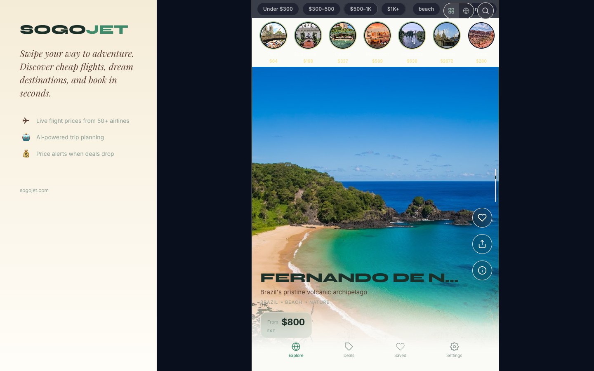
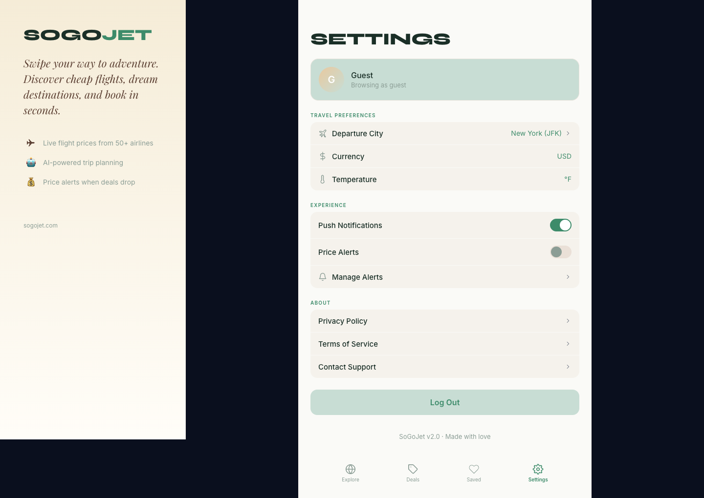
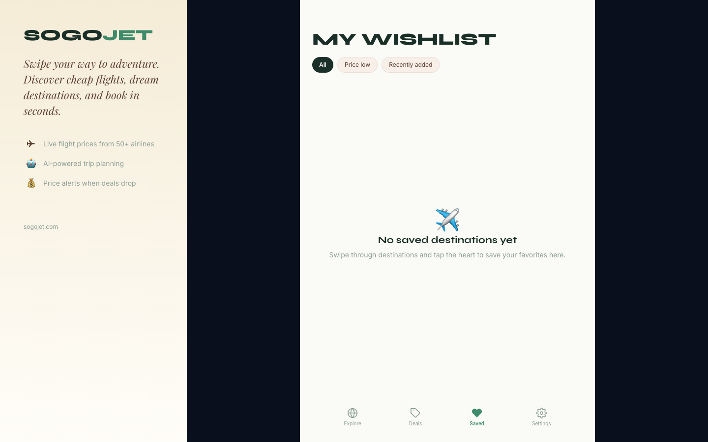
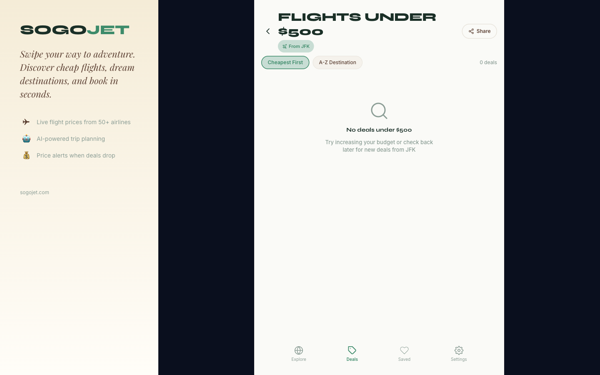

# Dogfood Report: SoGoJet

| Field | Value |
|-------|-------|
| **Date** | 2026-03-14 |
| **App URL** | https://sogojet.com |
| **Session** | sogojet-facelift-qa |
| **Scope** | Visual bugs, broken layouts, overlapping elements, color/contrast after facelift. Mobile (390x844) + Desktop (1440x900). |

## Summary

| Severity | Count |
|----------|-------|
| Critical | 0 |
| High | 3 |
| Medium | 4 |
| Low | 1 |
| **Total** | **8** |

## Issues

### ISSUE-001: Top-right controls (grid/globe/search) overlap filter chips on feed

| Field | Value |
|-------|-------|
| **Severity** | high |
| **Category** | visual |
| **URL** | https://sogojet.com/ |
| **Repro Video** | N/A |

**Description**

The view toggle (grid/globe) and search button are positioned absolutely at `top: 6px` which collides with the filter chip bar. On desktop, they sit right on top of the filter chips. On mobile they overlap the rightmost filter chip.

---

### ISSUE-002: Desktop shell has ugly dark navy gap between sidebar and phone frame

| Field | Value |
|-------|-------|
| **Severity** | high |
| **Category** | visual |
| **URL** | https://sogojet.com/ |
| **Repro Video** | N/A |

**Description**

On desktop (1440px), there's a wide dark navy (#0A0F1E) column between the warm cream sidebar and the phone-frame app column. This creates a jarring visual disconnect. The dark bg comes from the DesktopShell outer container — it should match the sidebar gradient or be a neutral color.

---

### ISSUE-003: Map view renders broken — dark bg with grey blobs instead of map tiles

| Field | Value |
|-------|-------|
| **Severity** | high |
| **Category** | functional |
| **URL** | https://sogojet.com/ (map view toggle) |
| **Repro Video** | N/A |

**Description**

Clicking the globe icon to switch to map view shows a dark background with grey continent-shaped blobs and price markers. The map tiles are not loading — appears to be a missing/broken tile provider configuration. Price markers float correctly but without a real map underneath they're useless.

*(User-provided screenshot — see conversation)*

---

### ISSUE-004: City name truncated too aggressively — "FERNANDO DE N..."

| Field | Value |
|-------|-------|
| **Severity** | medium |
| **Category** | visual |
| **URL** | https://sogojet.com/ |
| **Repro Video** | N/A |

**Description**

Long city names like "Fernando de Noronha" get truncated with ellipsis. The `whiteSpace: nowrap` + `textOverflow: ellipsis` we added is too aggressive for the feed card. City names should wrap to 2 lines max rather than truncate, since the card has plenty of vertical space.

---

### ISSUE-005: "SETTINGS" heading still uses Syne 800 uppercase

| Field | Value |
|-------|-------|
| **Severity** | medium |
| **Category** | visual |
| **URL** | https://sogojet.com/settings |
| **Repro Video** | N/A |

**Description**

The Settings page heading "SETTINGS" is still in Syne 800 bold uppercase. Per the design decisions, page headings should be Syne but section headings should be Inter 700 title case. This heading was not updated during the reskin.

---

### ISSUE-006: "MY WISHLIST" heading still uses Syne 800 uppercase

| Field | Value |
|-------|-------|
| **Severity** | medium |
| **Category** | visual |
| **URL** | https://sogojet.com/wishlist |
| **Repro Video** | N/A |

**Description**

Same issue as ISSUE-005. The Wishlist page heading is still in aggressive Syne uppercase instead of the new softer heading style.

---

### ISSUE-007: "FLIGHTS UNDER $500" heading still uses Syne 800 uppercase

| Field | Value |
|-------|-------|
| **Severity** | medium |
| **Category** | visual |
| **URL** | https://sogojet.com/deals |
| **Repro Video** | N/A |

**Description**

Same issue as ISSUE-005/006. The Deals page heading is still in Syne uppercase.

---

### ISSUE-008: Console error — missing airline logo (LL.png 404)

| Field | Value |
|-------|-------|
| **Severity** | low |
| **Category** | console |
| **URL** | https://sogojet.com/ |
| **Repro Video** | N/A |

**Description**

Console shows `Failed to load resource: 404` for `https://pics.avs.io/28/28/LL.png`. The airline code "LL" doesn't have a logo. Should fall back gracefully without a 404.

---
